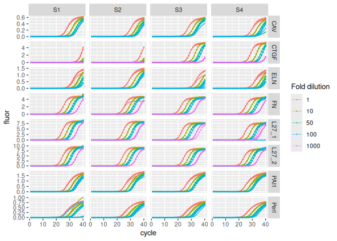

<!-- README.md is generated from README.Rmd. Please edit that file -->

# karlen

<!-- badges: start -->

[](https://CRAN.R-project.org/package=karlen)
<!-- badges: end -->

`{karlen}` provides real-time PCR data sets by Karlen et al. (2007) in
tidy format.

## Installation

``` r
install.packages("karlen")
```

## Data

The raw PCR amplification curve data by Karlen et al. (2007) is provided
as one single eponymously named data set: `karlen`. In the original
publication each data set pertaining one PCR plate is provided as a
separate spreadsheet file. The column `plate` in `karlen` distinguishes
each data set.

The `karlen` data set comprises quantitative real-time PCRs for four
samples (S1 thru S4), for seven amplicons targeting seven genes: Cav1,
Ctfg, Eln, Fn1, Rpl27, Hspg2, Serpine1.

For each sample/target combination a dilution series was performed. One
PCR plate was used per amplicon, except for Rpl27 (L27) that was assayed
twice (plates L27_1 and L27_2). The `target` column indicates the mouse
gene symbol matching the targeted amplicon.

``` r
library(ggplot2)
library(dplyr, warn.conflicts = FALSE)
library(karlen)

karlen |>
  dplyr::distinct(plate, target, sample, sample_type) |>
  print(n = Inf)
#> # A tibble: 36 × 4
#>    plate target   sample sample_type
#>    <fct> <fct>    <fct>  <fct>      
#>  1 CAV   Cav1     S1     std        
#>  2 CAV   Cav1     S2     std        
#>  3 CAV   Cav1     S3     std        
#>  4 CAV   Cav1     S4     std        
#>  5 CAV   Cav1     <NA>   ntc        
#>  6 CTGF  Ctgf     S1     std        
#>  7 CTGF  Ctgf     S2     std        
#>  8 CTGF  Ctgf     S3     std        
#>  9 CTGF  Ctgf     S4     std        
#> 10 ELN   Eln      S1     std        
#> 11 ELN   Eln      S2     std        
#> 12 ELN   Eln      S3     std        
#> 13 ELN   Eln      S4     std        
#> 14 ELN   Eln      <NA>   ntc        
#> 15 L27_1 Rpl27    S1     std        
#> 16 L27_1 Rpl27    S2     std        
#> 17 L27_1 Rpl27    S3     std        
#> 18 L27_1 Rpl27    S4     std        
#> 19 L27_2 Rpl27    S1     std        
#> 20 L27_2 Rpl27    S2     std        
#> 21 L27_2 Rpl27    S3     std        
#> 22 L27_2 Rpl27    S4     std        
#> 23 FN    Fn1      S1     std        
#> 24 FN    Fn1      S2     std        
#> 25 FN    Fn1      S3     std        
#> 26 FN    Fn1      S4     std        
#> 27 Perl  Hspg2    S1     std        
#> 28 Perl  Hspg2    S2     std        
#> 29 Perl  Hspg2    S3     std        
#> 30 Perl  Hspg2    S4     std        
#> 31 Perl  Hspg2    <NA>   ntc        
#> 32 PAI1  Serpine1 S1     std        
#> 33 PAI1  Serpine1 S2     std        
#> 34 PAI1  Serpine1 S3     std        
#> 35 PAI1  Serpine1 S4     std        
#> 36 PAI1  Serpine1 <NA>   ntc
```

Two dilution series schemes were assayed:

1.  Scheme 1 (Cav1, Eln, Hspg2, Serpine1): one-fold, ten-fold, 50-fold,
    and 100-fold;
2.  Scheme 2 (Ctgf, Rpl27, Fn1): one-fold, ten-fold, 50-fold, 100-fold
    and 1000-fold (two replicates only).

``` r
karlen |>
  dplyr::filter(sample_type == "std") |>
  dplyr::distinct(plate, target, dilution) |>
  print(n = Inf)
#> # A tibble: 36 × 3
#>    plate target   dilution
#>    <fct> <fct>       <int>
#>  1 CAV   Cav1            1
#>  2 CAV   Cav1           10
#>  3 CAV   Cav1           50
#>  4 CAV   Cav1          100
#>  5 CTGF  Ctgf            1
#>  6 CTGF  Ctgf           10
#>  7 CTGF  Ctgf           50
#>  8 CTGF  Ctgf          100
#>  9 CTGF  Ctgf         1000
#> 10 ELN   Eln             1
#> 11 ELN   Eln            10
#> 12 ELN   Eln            50
#> 13 ELN   Eln           100
#> 14 L27_1 Rpl27           1
#> 15 L27_1 Rpl27          10
#> 16 L27_1 Rpl27          50
#> 17 L27_1 Rpl27         100
#> 18 L27_1 Rpl27        1000
#> 19 L27_2 Rpl27           1
#> 20 L27_2 Rpl27          10
#> 21 L27_2 Rpl27          50
#> 22 L27_2 Rpl27         100
#> 23 L27_2 Rpl27        1000
#> 24 FN    Fn1             1
#> 25 FN    Fn1            10
#> 26 FN    Fn1            50
#> 27 FN    Fn1           100
#> 28 FN    Fn1          1000
#> 29 Perl  Hspg2           1
#> 30 Perl  Hspg2          10
#> 31 Perl  Hspg2          50
#> 32 Perl  Hspg2         100
#> 33 PAI1  Serpine1        1
#> 34 PAI1  Serpine1       10
#> 35 PAI1  Serpine1       50
#> 36 PAI1  Serpine1      100
```

Visualization of amplification curves (NTC curves are omitted):

``` r
karlen |>
  dplyr::filter(sample_type != "ntc") |>
  ggplot(aes(x = cycle, y = fluor, group = well, col = as.factor(dilution))) +
  geom_line(linewidth = 0.1) +
  geom_point(size = 0.05) +
  facet_grid(rows = vars(plate), cols = vars(sample), scales = "free_y") +
  labs(color = "Fold dilution")
```


